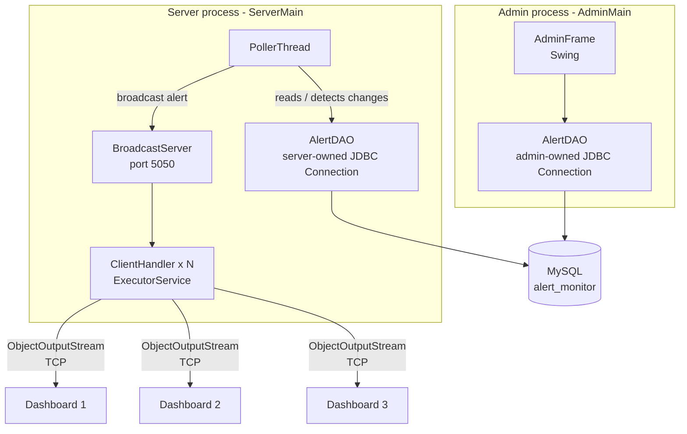
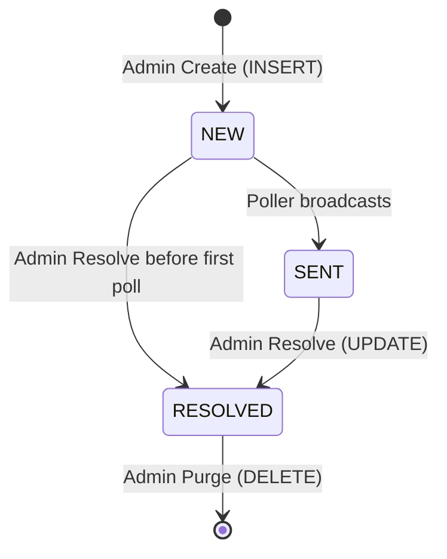
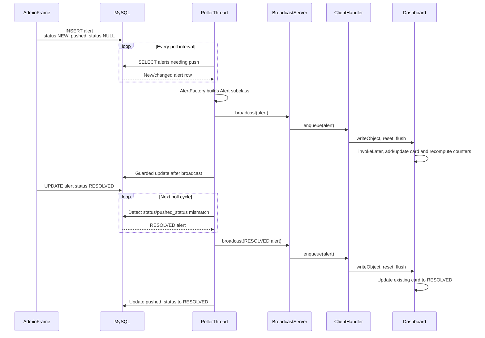

# Real-Time Database Monitor & Alert System
## Master Project Context and Implementation Guide

> **Purpose:** This document is the primary implementation context for AI-assisted development of the project.
>
> It describes the architecture, responsibilities, data flow, state transitions, implementation order, threading model, database behavior, networking behavior, GUI behavior, testing strategy, and the required diagrams.
>
> **Important:** This document contains no Java implementation code. It may contain canonical SQL, configuration examples, compile/run commands, contracts, pseudocode, diagrams, and acceptance tests where those are required to define exact project behavior.
>
> **AI principle:** The AI is an implementation assistant, not a requirements author. If the repository or this merged context does not provide enough information to make a safe implementation decision, the AI must stop and ask rather than inventing behavior.
>
> **Status:** FINAL — this document is the single source of truth for project requirements, architecture, implementation behavior, contracts, testing, scope, and AI-assisted development.

---

# 0. AI Pre-Implementation Checklist

This section is mandatory before the AI writes, deletes, or modifies project code.

The AI must **not begin implementation immediately after reading only the user's request**.

Before making any code change, the AI must perform the following sequence:

```text
1. Inspect the repository.
2. Read this master context completely enough to identify the relevant rules.
3. Inspect `schema.sql` when database behavior is involved.
4. Identify the existing package and folder structure.
6. Identify the existing package and folder structure.
7. Identify existing classes, interfaces, methods, constructors, fields and configuration.
8. Compare the existing implementation against the requested behavior.
9. Identify which requirements are VERIFIED, SPECIFIED, or UNKNOWN.
10. Identify conflicts between repository code and project documentation.
11. Determine the smallest set of files that must change.
12. Confirm that the requested change is within project scope.
13. State any safe assumptions that are actually supported by project evidence.
14. Ask for clarification for unresolved information that is necessary for implementation.
15. Only then implement the requested change.
```

### Mandatory pre-implementation questions

Before coding, the AI must be able to answer:

- What existing component owns this behavior?
- What existing interface or contract does it have to satisfy?
- Which requirement or contract in this master context defines the required behavior?
- Which database fields are involved?
- Which thread owns the operation?
- Which process owns the resource involved?
- Does the change affect serialization or networking?
- Does the change affect the Swing EDT?
- Does the change affect an acceptance criterion?
- Does the change require a contract or schema modification?
- Is the requested behavior explicitly in scope?

If any required answer is unknown, the AI must stop and request the missing information rather than inventing it.

### No implementation from context alone

This master context is the project source of truth, but it does not authorize inventing repository-specific details that have not been verified.

If an exact class, method, SQL statement, package, constructor, configuration key, or schema definition is not defined here or verified in the repository, the AI must stop and ask rather than invent it.

---

# 0.2 Existing Repository Preservation Rule

The existing repository is a project artifact, not disposable generated output.

The AI must preserve existing implementation unless the requested task explicitly requires a change.

The AI must **not**:

- delete existing classes without explicit justification;
- replace working modules with a newly generated alternative;
- rewrite unrelated files;
- remove existing methods merely because a different implementation is preferred;
- remove existing SQL because another SQL statement appears cleaner;
- replace existing configuration with a new configuration system;
- reorganize packages without explicit approval;
- replace existing architecture with a preferred architecture;
- remove tests that currently verify project behavior.

When modifying an existing component:

```text
Inspect
  |
  v
Understand
  |
  v
Make smallest required change
  |
  v
Compile
  |
  v
Run affected tests
  |
  v
Verify unchanged behavior
```

If a complete replacement appears necessary, the AI must explain why and wait for approval when the replacement affects architecture, public interfaces, database schema, or frozen contracts.

---

# 0.3 Dependency Policy

The project intentionally uses a small technology surface.

### Core allowed technologies

The implementation is based on:

- Java;
- Java standard library;
- Java Swing;
- JDBC;
- MySQL;
- MySQL JDBC driver;
- TCP sockets;
- Java object serialization;
- `javac` and `java`.

The exact MySQL JDBC driver version and JAR location must be taken from the existing project setup or explicitly provided project instructions.

The AI must **not invent a dependency version, JAR filename, download location, or classpath entry** when the repository already defines these details elsewhere.

### Dependencies requiring explicit approval

The AI must not introduce third-party libraries or frameworks unless the project specification or team explicitly approves them.

Examples include:

- Spring;
- Spring Boot;
- Hibernate;
- JPA;
- Lombok;
- Jackson;
- Gson;
- Apache Commons libraries;
- third-party GUI frameworks;
- third-party networking libraries;
- dependency-injection frameworks;
- external messaging libraries;
- build-system plugins that are not already part of the project.

A library must not be introduced merely because it makes implementation easier.

### Build-system rule

The project uses the build approach defined by the existing project configuration and technology decisions.

If the project is configured around `javac` and `java`, the AI must not introduce Maven or Gradle merely to simplify dependency management.

---

# 0.4 Exact Repository Structure Rule

If the repository already contains a package or folder structure, that structure is authoritative unless the project specification explicitly requires a change.

The AI must:

1. inspect the existing structure;
2. reuse existing packages where appropriate;
3. place new files according to the existing architecture;
4. avoid creating parallel duplicate packages;
5. avoid moving classes solely for stylistic reasons.

If the repository structure conflicts with the specification, the AI must report the conflict instead of silently reorganizing the project.

If the repository structure has not yet been established, the AI may propose one, but the proposal must be presented for approval before it becomes a frozen project decision.

---

# 0.5 Database Driver and Runtime Dependency Rule

The project requires a MySQL JDBC driver because Java's standard library does not itself provide the MySQL-specific JDBC implementation.

The AI must determine the driver's:

- version;
- JAR filename;
- location;
- classpath requirement;
- runtime configuration

from the existing repository or explicit project instructions.

The AI must not assume a filename such as `mysql-connector-j-x.x.x.jar` is present unless it has actually been verified.

If the driver is missing and its exact source/configuration is not specified, the AI must report:

```text
BLOCKED

Reason:
The MySQL JDBC driver required for database connectivity is not available
or its project-approved version/location is not defined.

Affected component:
JDBC database connectivity.

Decision required:
Provide or approve the project JDBC driver configuration.
```

---

# 0.6 No Silent Deletion or Replacement

A coding request such as:

```text
"implement the dashboard"
"fix the DAO"
"add reconnection"
"make the server work"
```

does **not** automatically authorize deletion or replacement of existing code.

The AI must distinguish:

```text
Modify existing component
        ≠
Replace existing component
        ≠
Delete existing component
        ≠
Redesign architecture
```

Only the first is assumed safe when the requested behavior can be implemented without broader changes.

Any broader change must be explicitly identified.

---

# 0.7 Change Impact Checklist

Before modifying a component, the AI should identify whether the change affects:

```text
[ ] Public class/interface names
[ ] Constructors
[ ] Method signatures
[ ] Serialization
[ ] Database schema
[ ] SQL behavior
[ ] Alert state transitions
[ ] pushed_status semantics
[ ] Poller ordering
[ ] Thread ownership
[ ] Swing EDT behavior
[ ] TCP protocol
[ ] Client reconnect behavior
[ ] Dashboard deduplication
[ ] Acceptance criteria
[ ] Module ownership
[ ] Existing tests
[ ] Documentation/diagrams
```

If one or more checked items are affected, the AI must verify the relevant contract before implementation.


---

## 0.8 Master Source-of-Truth Status

**STATUS: FINAL — SINGLE SOURCE OF TRUTH**

This document is self-contained. It defines the project requirements, architecture, scope, contracts, database behavior, networking behavior, threading model, GUI behavior, implementation sequence, testing strategy, acceptance criteria, academic requirements, and AI development rules.

No separate project document is required to interpret the requirements contained here.

### Final conflict resolutions

| Topic | Final rule |
|---|---|
| Database | **MySQL 8.x only; H2 is not part of the project** |
| Lifecycle | **NEW -> SENT -> RESOLVED** |
| Admin | **Separate Admin process with its own JDBC connection** |
| Service-down class | **ServiceUnavailableAlert** |
| Polling update | **Broadcast first, then guarded DB update** |
| Delivery | **At-least-once; dashboard deduplicates by alert ID** |
| Networking | **Server output stream -> client input stream; client sends nothing** |
| CDC | **Query-based polling; no transaction-log CDC** |
| Shared contracts | **Requirements and contracts defined in this document are frozen unless explicitly changed through the change process** |

Any older wording elsewhere in this document that conflicts with one of these final rules is historical context only and must not be treated as an active requirement.

---

# 1. Project Identity

## 1.1 Project Name

**Real-Time Database Monitor & Alert System**

## 1.2 Project Objective

The project demonstrates a complete event-monitoring pipeline using:

- MySQL;
- Java;
- JDBC;
- Java Swing;
- TCP sockets;
- Java object serialization;
- multithreading;
- polling;
- server-side broadcasting;
- multiple live dashboards.

The main demonstration is:

> An administrator creates an alert in MySQL through the Admin application. A server-side polling thread detects the alert, converts it into an alert object, broadcasts it through a TCP server, and multiple connected dashboard applications update automatically.

---

# 2. Core Concept

Traditional database applications generally follow:

```text
User action
    |
    v
Application
    |
    v
Database query
    |
    v
Display
```

This project demonstrates a push-oriented dashboard:

```text
Admin
  |
  | creates/changes alert
  v
MySQL
  |
  | polling
  v
PollerThread
  |
  | broadcast
  v
BroadcastServer
  |
  | TCP
  v
ClientHandler
  |
  | serialized Alert
  v
Dashboard
```

The database-to-server portion is **polling**.

The server-to-dashboard portion is **push over persistent TCP connections**.

This distinction must remain clear in documentation and presentations.

---

# 3. Project Goals

The completed system demonstrates:

1. JDBC database access.
2. MySQL integration.
3. Database CRUD operations.
4. Object-oriented alert modelling.
5. Inheritance.
6. Polymorphism.
7. Custom exceptions.
8. Multithreading.
9. TCP networking.
10. Multiple simultaneous clients.
11. Thread-safe client management.
12. Swing GUI programming.
13. Swing Event Dispatch Thread usage.
14. SwingWorker-based database operations.
15. Automatic client reconnection.
16. Database failure recovery.
17. At-least-once alert delivery.
18. Alert state transitions.
19. Race protection between polling and administrator actions.
20. End-to-end integration of database, server and GUI clients.

---

# 4. Scope Declaration

This section is a **hard project boundary**.

The AI must treat the following as the authoritative declaration of what this project is and is not responsible for implementing.

## 4.1 In-Scope Declaration

The following functionality is explicitly **IN SCOPE**.

### Applications

- Admin application;
- Server application;
- multiple Dashboard applications.

### Database

- MySQL database;
- the defined `alerts` table;
- JDBC connectivity;
- required alert CRUD operations;
- alert status management;
- pushed-status tracking.

### Alert Management

- alert creation;
- alert viewing;
- alert resolution;
- resolved-alert purging;
- selected-alert deletion;
- burst simulation;
- alert status transitions;
- alert type handling;
- alert severity handling.

### Server Monitoring

- periodic database polling;
- detection of newly created alerts;
- detection of alert status changes;
- conversion of database rows into alert objects;
- alert broadcasting;
- guarded database state updates;
- database failure recovery;
- clean poller shutdown.

### Networking

- TCP server;
- dashboard client connections;
- multiple simultaneous dashboard clients;
- maximum client limit;
- per-client `ClientHandler`;
- per-client outgoing queues;
- Java object serialization;
- alert broadcasting to connected clients;
- disconnected-client cleanup.

### Dashboard

- live alert display;
- alert cards;
- alert-ID-based deduplication/update;
- resolved-state display;
- counters;
- connection status;
- reconnecting status;
- automatic client reconnection;
- Swing EDT-safe UI updates.

### Concurrency

- `PollerThread`;
- client handler threads;
- dashboard listener/reconnection thread;
- Swing Event Dispatch Thread;
- `SwingWorker` for Admin database operations;
- executor-based client handling;
- thread-safe client management.

### Reliability

- at-least-once alert delivery;
- idempotent dashboard updates;
- race protection between polling and Admin updates;
- database failure recovery;
- client disconnect handling;
- server restart/reconnection behavior;
- clean resource shutdown.

### Demonstration and Testing

- component-level testing;
- database testing;
- DAO testing;
- polling testing;
- networking testing;
- dashboard testing;
- full end-to-end integration testing;
- failure demonstrations;
- burst-alert demonstrations.

---

## 4.2 Out-of-Scope Declaration

The following functionality is explicitly **OUT OF SCOPE**.

The AI must **not implement, introduce, or recommend these as required project components** unless the team explicitly changes the scope.

### Frameworks and Architecture

- Spring Boot;
- Spring Framework;
- REST APIs;
- GraphQL;
- microservices architecture;
- ORM frameworks such as Hibernate/JPA;
- dependency-injection frameworks;
- Maven;
- Gradle;
- replacement of the current Java/Swing architecture.

### Messaging and Infrastructure

- Kafka;
- RabbitMQ;
- Redis;
- message brokers;
- database CDC systems;
- WebSockets;
- replacing the TCP socket architecture with HTTP/REST;
- cloud messaging services.

### Deployment

- cloud deployment;
- Kubernetes;
- Docker-based production deployment;
- distributed multi-server deployment;
- load balancing;
- high-availability clustering;
- multi-datacenter deployment.

### Security Features Not Required by This Project

- user authentication;
- role-based authorization;
- OAuth;
- JWT;
- enterprise identity providers;
- production-grade TLS implementation;
- encryption-at-rest architecture;
- enterprise key management;
- security monitoring infrastructure.

The absence of these features is a **scope decision**, not an implementation defect.

### Advanced Database Features

- database triggers unless explicitly required by the existing specification;
- stored procedures unless explicitly required;
- database replication;
- sharding;
- partitioning;
- change-data-capture pipelines;
- event sourcing;
- replacing polling with database-native event mechanisms.

The project intentionally demonstrates **database polling**, so an AI must not replace it with CDC or another mechanism.

### Dashboard Features

- persistent historical dashboard storage;
- offline event replay;
- synchronization of missed events after reconnect;
- user accounts;
- dashboard authentication;
- remote dashboard management;
- mobile applications;
- browser-based dashboards;
- cloud-hosted dashboards.

A dashboard that reconnects only receives future broadcasts. Historical replay is not part of this project.

### Alerting Channels

The project does not require:

- email alerts;
- SMS alerts;
- WhatsApp alerts;
- push notifications;
- phone calls;
- third-party notification services.

### AI / Machine Learning

AI or machine learning is **not a required part of the core implementation** described by this project.

Do not add:

- LLM integration;
- predictive analytics;
- anomaly-detection models;
- machine-learning classifiers;
- generative AI;
- external AI APIs.

If AI is later requested, it must be treated as a separately approved scope change rather than silently added to the architecture.

### Production-Grade Features

The project is an academic/demo system and does not require:

- enterprise observability platforms;
- distributed tracing;
- production SLA management;
- production disaster recovery;
- enterprise backup architecture;
- advanced audit logging;
- multi-region failover;
- production capacity planning.

---

## 4.3 Scope Boundary Rule

When implementing a requested feature, the AI must first determine whether it is:

```text
IN SCOPE
    |
    +--> Implement according to the specification.

OUT OF SCOPE
    |
    +--> Do not implement unless the team explicitly approves
         a scope change.

UNKNOWN
    |
    +--> Do not guess.
         Ask for clarification.
```

An out-of-scope feature must never be introduced merely because the AI considers it:

- more modern;
- more scalable;
- more secure;
- more professional;
- easier to implement;
- industry standard;
- a better architecture.

The project's objective is to implement the **specified system**, not to redesign it into a different system.

---

## 4.4 Scope Change Procedure

If the team decides that an out-of-scope feature is required:

```text
1. Identify the requested feature.
2. State why it is needed.
3. Identify affected components.
4. Identify affected interfaces/contracts.
5. Identify affected database changes.
6. Identify affected diagrams.
7. Identify affected tests.
8. Explicitly approve the scope change.
9. Update this master context.
10. Update the affected frozen contract sections in this master context.
11. Update the architecture diagrams.
12. Implement the approved change.
13. Re-run affected tests.
```

The AI must not perform steps 9–13 silently.

---

## 4.5 Scope Integrity Rule

The following principle applies to the entire project:

> **If a feature is not explicitly required by the project specification or listed as in scope here, it must not be assumed to be part of the implementation.**

Similarly:

> **If a feature is explicitly listed as out of scope, the AI must not add it without an explicit scope-change decision.**

This prevents feature creep, architectural drift, and AI-generated requirements.

---

# 5. Technology Decisions

| Area | Decision |
|---|---|
| Language | Java |
| Source compatibility | Java 8 |
| GUI | Java Swing |
| Database | MySQL 8.x (FINAL; H2 fallback removed) |
| Database access | Raw JDBC |
| Networking | TCP sockets |
| Object transfer | Java serialization |
| Build system | `javac` and `java` |
| Default server port | 5050 |
| Demonstration environment | One machine using localhost |

The installed JDK may be newer than Java 8, but the source must remain Java 8 compatible.

---

# 6. High-Level Architecture

The system consists of three application processes.

## 6.1 Server Process

The Server process contains:

- `ServerMain`;
- `PollerThread`;
- `BroadcastServer`;
- multiple `ClientHandler` instances;
- a server-owned JDBC connection through `AlertDAO`.

The Server is responsible for detecting database changes and broadcasting alerts.

## 6.2 Admin Process

The Admin process contains:

- `AdminMain`;
- `AdminFrame`;
- an `AlertDAO`;
- an Admin-owned JDBC connection.

The Admin creates and manages database alerts.

## 6.3 Dashboard Processes

Each Dashboard process contains:

- `ClientMain`;
- `DashboardFrame`;
- `AlertListenerThread`;
- alert cards;
- a connection status indicator.

Dashboards do not connect directly to MySQL.

---

# 7. Architecture Diagram

The following diagram represents the intended architecture.



---

# 8. Component Responsibilities

## 8.1 MySQL

MySQL is the persistent source of alert records.

It stores:

- alert ID;
- alert type;
- severity;
- source;
- message;
- status;
- pushed status;
- creation time.

It does not communicate directly with dashboard clients.

---

## 8.2 AlertDAO

`AlertDAO` is the database access boundary.

Its responsibility is to translate application operations into database operations.

Logical responsibilities:

- create alert;
- read alerts;
- find alerts requiring broadcast;
- mark an alert as sent;
- record pushed status;
- resolve an alert;
- purge resolved alerts;
- delete an alert.

The DAO must not contain GUI logic.

The DAO must not contain socket logic.

---

## 8.3 PollerThread

The poller is the bridge between MySQL and the server.

It:

1. periodically checks the database;
2. finds alerts whose current status has not been broadcast;
3. converts database rows into alert objects;
4. sends those objects to `BroadcastServer`;
5. updates the database after broadcasting;
6. retries after database failures.

The poller must not write directly to client sockets.

---

## 8.4 BroadcastServer

`BroadcastServer` owns the TCP server.

It:

- listens on the configured port;
- accepts dashboard connections;
- enforces the maximum client count;
- manages connected `ClientHandler` instances;
- broadcasts alerts to all connected clients.

The broadcast operation must not block the poller because of a slow client.

---

## 8.5 ClientHandler

Each connected dashboard has one `ClientHandler`.

It:

- owns that client's outgoing connection;
- owns that client's output queue;
- receives alerts from the server broadcast mechanism;
- writes queued alerts to the dashboard;
- removes itself when the connection fails.

Only the client handler should write to its client's object stream.

---

## 8.6 Dashboard

The dashboard is a Swing GUI.

It:

- shows connection state;
- displays alert cards;
- updates existing alerts;
- keeps resolved alerts visible;
- maintains counters;
- survives temporary server outages;
- automatically reconnects.

The dashboard never queries MySQL.

---

# 9. Database Ownership

There is one process-owned JDBC connection per application process.

Therefore:

```text
Admin process
    |
    +-- AlertDAO
    |
    +-- Admin-owned Connection

Server process
    |
    +-- AlertDAO
    |
    +-- Server-owned Connection
```

A connection is not created for every DAO operation.

Statements and result sets are short-lived resources.

The long-lived connection belongs to the process.

This distinction is important for both implementation and viva explanation.

---

# 10. Database Model

The main table is:

```text
alerts
```

It contains at least:

| Column | Meaning |
|---|---|
| `id` | unique alert identifier |
| `type` | alert category |
| `severity` | alert severity |
| `source` | source/service producing the alert |
| `message` | human-readable description |
| `status` | current alert lifecycle state |
| `pushed_status` | last status successfully broadcast |
| `created_at` | creation timestamp |

The exact schema must follow the database contract defined in this master context and the verified `schema.sql` in the repository.

The AI must not invent additional database columns.

---

# 11. Alert Types

The project defines three alert types:

1. `CpuAlert`
2. `TransactionFailureAlert`
3. `ServiceUnavailableAlert`

The common base type is:

```text
Alert
```

`Alert` is abstract and serializable.

The subclasses demonstrate polymorphism.

The system should work with an `Alert` reference rather than requiring the networking layer to know the concrete subclass.

---

# 12. Alert State Model

The primary alert states are:

```text
NEW
SENT
RESOLVED
```

Normal lifecycle:

```text
NEW
 |
 | Poller broadcasts
 v
SENT
 |
 | Admin resolves
 v
RESOLVED
```

An alert can also be resolved before its first poll:

```text
NEW
 |
 | Admin resolves before first broadcast
 v
RESOLVED
```

After an alert is resolved and its resolved state has been pushed, it can be purged from the database.

---

# 13. State Diagram



### Important interpretation

`RESOLVED` is a meaningful application state.

Deletion is not another alert state.

Once purged, the database row no longer exists.

---

# 14. Meaning of pushed_status

`pushed_status` records the last alert status that the poller successfully broadcast.

Examples:

| status | pushed_status | Meaning |
|---|---|---|
| NEW | NULL | never broadcast |
| NEW | NEW | unusual/transitional state; not normally retained after successful first push |
| SENT | SENT | SENT state has been broadcast |
| RESOLVED | SENT | resolved in DB but resolved event still needs broadcasting |
| RESOLVED | RESOLVED | resolved state has been broadcast |

The poller uses this distinction to determine whether a row still has an event that needs to be sent.

---

# 15. Polling Rule

The poller searches for alerts where:

```text
pushed_status is NULL
OR
status is different from pushed_status
```

This means:

```text
never pushed
OR
database state changed after the last push
```

The explicit NULL case is required.

The implementation must preserve the semantics defined in the project specification.

---

# 16. Sequence of One Alert

The intended lifecycle of one alert is:

```text
AdminFrame
    |
    | create alert
    v
MySQL
    |
    | status=NEW
    | pushed_status=NULL
    |
    v
PollerThread
    |
    | periodic SELECT
    v
AlertFactory
    |
    | builds concrete Alert subclass
    v
BroadcastServer
    |
    | broadcast(alert)
    v
ClientHandler(s)
    |
    | queue alert
    v
ObjectOutputStream
    |
    v
Dashboard(s)
    |
    | invokeLater
    v
Alert card inserted/updated
```

After the broadcast:

```text
PollerThread
    |
    | guarded database update
    v
MySQL
```

If the administrator resolves the alert:

```text
AdminFrame
    |
    | UPDATE status=RESOLVED
    v
MySQL
    |
    | next poll detects mismatch
    v
PollerThread
    |
    | broadcast RESOLVED
    v
Dashboard
    |
    | update existing card
    v
RESOLVED display
```

---

# 17. Sequence Diagram



---

# 18. Implementation Flow

The project should be implemented in controlled phases.

```text
Phase 1
Database + configuration
        |
        v
Phase 2
Common alert model
        |
        v
Phase 3
DAO
        |
        v
Phase 4
Admin application
        |
        v
Phase 5
Poller
        |
        v
Phase 6
TCP server
        |
        v
Phase 7
Dashboard networking
        |
        v
Phase 8
Dashboard GUI
        |
        v
Phase 9
Failure handling
        |
        v
Phase 10
Full integration
```

Do not ask an AI to implement all phases in one step.

---

# 19. Phase 1 - Database and Configuration

## Objective

Make the database independently usable before implementing networking.

## Implementation sequence

1. Verify MySQL is installed and running.
2. Create the project database.
3. Create the application database user.
4. Apply the project's schema.
5. Verify the `alerts` table.
6. Verify indexes required by the polling query.
7. Create/load application configuration.
8. Verify the JDBC driver is available.
9. Verify the application can establish a JDBC connection.
10. Verify the connection can be closed cleanly.

## Completion condition

The database can be started independently of Java.

The Java application can establish its process-owned JDBC connection.

---

# 20. Phase 2 - Common Alert Model

## Objective

Create the shared vocabulary used by Admin, Server and Client.

## Implementation sequence

1. Implement the common `Alert` abstraction according to the frozen contract defined in this master context.
2. Implement the three alert subclasses.
3. Implement the status representation.
4. Implement the severity representation.
5. Implement the factory.
6. Implement validation/custom exception behavior.
7. Ensure the alert objects are serializable.
8. Ensure all processes can use the same common model.

## Completion condition

A database alert can conceptually be represented as the correct concrete `Alert` object without involving networking or Swing.

---

# 21. Phase 3 - DAO

## Objective

Make database operations reliable before adding concurrency.

## Implementation sequence

1. Establish the DAO's process-owned JDBC connection.
2. Implement alert creation.
3. Implement retrieval of all alerts.
4. Implement detection of unpushed/changed alerts.
5. Implement guarded transition from NEW to SENT.
6. Implement pushed-status recording.
7. Implement resolution.
8. Implement resolved-alert purge.
9. Implement selected deletion.
10. Add appropriate resource handling.
11. Test each operation independently.

## Completion condition

The database lifecycle works correctly without the server or GUI.

---

# 22. DAO Test Order

Test in this exact conceptual order:

```text
Create
  |
  v
Read
  |
  v
Verify NEW / NULL
  |
  v
Find unpushed
  |
  v
Mark SENT
  |
  v
Resolve
  |
  v
Find changed status
  |
  v
Record RESOLVED pushed status
  |
  v
Purge
```

This makes it much easier to isolate database bugs before introducing networking.

---

# 23. Phase 4 - Admin Application

## Objective

Give the administrator a GUI for manipulating alert records.

## Required controls

The Admin GUI includes:

- alert type selection;
- severity selection;
- source input;
- message input;
- Insert;
- Simulate Burst;
- Refresh;
- Resolve;
- Purge Resolved;
- Delete Selected;
- alert table;
- status information.

## Implementation sequence

1. Create the main Admin window.
2. Add input controls.
3. Add table model.
4. Connect the table to DAO reads.
5. Connect Insert to DAO create.
6. Connect Resolve to DAO resolution.
7. Connect Purge to DAO purge.
8. Connect Delete to DAO deletion.
9. Add burst simulation.
10. Add periodic refresh.
11. Move database operations away from the EDT.
12. Add validation/error dialogs.

---

# 24. Admin Threading

The Admin GUI uses the Swing Event Dispatch Thread.

Therefore:

```text
EDT
 |
 | button click
 v
SwingWorker
 |
 | database operation
 v
DAO
 |
 v
MySQL
```

After completion:

```text
SwingWorker
 |
 | result/error
 v
EDT
 |
 v
update GUI
```

The GUI must remain responsive while MySQL operations are executing.

---

# 25. Phase 5 - Poller

## Objective

Connect the database layer to the networking layer.

## Implementation sequence

1. Create the polling thread.
2. Give it access to the server-owned DAO.
3. Give it access to the broadcast server.
4. Configure the polling interval.
5. Ensure the database connection is usable.
6. Query alerts requiring a push.
7. Convert each row through the alert factory.
8. Ignore/log unknown types according to the defined rule.
9. Broadcast valid alerts.
10. Perform the appropriate guarded database update.
11. Repeat after the configured interval.
12. Add interruption/shutdown behavior.
13. Add database-failure recovery.

---

# 26. Poller Ordering Rule

The critical ordering is:

```text
READ
  |
  v
BUILD ALERT
  |
  v
BROADCAST
  |
  v
UPDATE DATABASE
```

Do not reverse the last two steps without an explicit contract change.

The reason is the required delivery guarantee.

---

# 27. Delivery Guarantee

The system provides:

**At-least-once delivery.**

It does not provide exactly-once delivery.

Example failure:

```text
1. Poller reads alert.
2. Poller broadcasts alert.
3. Server crashes.
4. Database update has not completed.
5. Server restarts.
6. Poller sees the alert as still unpushed.
7. Alert may be broadcast again.
```

Therefore the Dashboard must be idempotent with respect to alert ID.

---

# 28. Dashboard Deduplication

Every dashboard maintains a mapping conceptually equivalent to:

```text
Alert ID -> Alert Card
```

When an alert arrives:

```text
ID exists?
   |
   +-- No --> create card
   |
   +-- Yes -> update card
```

This is what makes at-least-once delivery safe for the GUI.

---

# 29. Race Protection

A critical race exists between:

```text
Poller
```

and:

```text
Admin
```

Example:

```text
Poller reads:
status = NEW

Admin resolves:
status = RESOLVED

Poller attempts:
status = SENT
```

The poller's transition must be guarded so that it only succeeds if the row is still `NEW`.

If the update affects zero rows:

```text
the poller must not assume it successfully changed the state
```

The next polling cycle must be able to detect the actual database state.

The administrator's `RESOLVED` state must never be overwritten by a stale poller operation.

---

# 30. Phase 6 - TCP Server

## Objective

Deliver alerts to multiple dashboards simultaneously.

## Implementation sequence

1. Create the server socket.
2. Bind it to the configured host/port.
3. Start the client acceptance loop.
4. Accept a dashboard socket.
5. Check maximum client capacity.
6. Create a `ClientHandler`.
7. Add it to the client collection.
8. Submit it to the executor.
9. Continue accepting additional clients.
10. Remove handlers when clients disconnect.
11. Shut down handlers and executor cleanly.

---

# 31. Maximum Client Handling

The server has a configured maximum number of dashboard clients.

When the maximum is reached:

```text
new connection
    |
    v
check capacity
    |
    v
limit reached
    |
    +--> log event
    |
    +--> close new connection
```

Existing clients remain unaffected.

---

# 32. Phase 7 - Client Handler

## Objective

Prevent slow dashboards from blocking the server.

Each client handler owns:

- one client socket;
- one output stream;
- one outgoing queue;
- one handler execution context.

The queue separates:

```text
server broadcast speed
```

from:

```text
client network speed
```

---

# 33. Client Queue Flow

```text
PollerThread
     |
     v
BroadcastServer
     |
     v
ClientHandler.enqueue()
     |
     v
BlockingQueue
     |
     v
ClientHandler thread
     |
     v
ObjectOutputStream
     |
     v
Dashboard
```

The `BroadcastServer` should never wait for the client to finish writing.

---

# 34. Serialization Behavior

The server sends `Alert` objects using Java object serialization.

For each alert:

```text
write object
    |
    v
reset serialization state
    |
    v
flush stream
```

This ensures the serialized stream is pushed to the connected client.

The client reads the resulting `Alert` object.

---

# 35. Phase 8 - Dashboard Networking

## Objective

Create a dashboard that can connect, receive alerts and reconnect automatically.

## Implementation sequence

1. Start the dashboard GUI.
2. Start the listener thread.
3. Attempt connection to the server.
4. Update the GUI to Connected.
5. Create the input object stream.
6. Wait for incoming alerts.
7. Read one alert.
8. Transfer the alert to the EDT.
9. Update the dashboard.
10. Detect socket failure.
11. Update status to Reconnecting.
12. Wait for the configured reconnect interval.
13. Attempt connection again.
14. Repeat until application shutdown.

---

# 36. Client Reconnection

The dashboard should behave as:

```text
CONNECTED
    |
    | server/network failure
    v
RECONNECTING
    |
    | wait
    v
CONNECT ATTEMPT
    |
    +---- failure ----> RECONNECTING
    |
    +---- success ----> CONNECTED
```

Existing cards remain visible during disconnection.

A dashboard that was offline does not receive historical alerts that were broadcast while it was disconnected.

This is an accepted limitation.

---

# 37. Phase 9 - Dashboard GUI

## Objective

Turn received alert objects into visible live dashboard cards.

## Implementation sequence

1. Create the main dashboard window.
2. Add connection-status display.
3. Add alert-card container.
4. Add counters.
5. Receive an `Alert`.
6. Check its ID.
7. Create a card if the ID is new.
8. Update the card if the ID already exists.
9. Apply the subclass-specific presentation.
10. Recompute counters.
11. Keep resolved cards visible.
12. Mark resolved cards visually as resolved/grey.

---

# 38. Swing Threading Model

There are two worlds:

```text
Network / background threads
```

and:

```text
Swing EDT
```

Network threads must not directly manipulate Swing components.

The correct conceptual flow is:

```text
Socket thread
    |
    | receives Alert
    v
schedule UI operation
    |
    v
Swing EDT
    |
    v
update card/counters/status
```

This rule applies to every dashboard UI update.

---

# 39. Dashboard Counter Strategy

Counters should be recomputed from the current dashboard cards after each alert update.

Conceptually:

```text
all cards
    |
    v
inspect current state of every card
    |
    v
recalculate counters
    |
    v
update counter labels
```

Do not rely only on increment/decrement operations.

The reason is that the same alert can arrive multiple times due to at-least-once delivery.

---

# 40. Unknown Alert Type

If MySQL contains an unsupported alert type:

```text
read row
    |
    v
factory cannot create known subclass
    |
    v
log problem once for that alert ID
    |
    v
skip row
    |
    v
continue processing other rows
```

The invalid row must not:

- be broadcast;
- have its status changed;
- have its pushed status changed;
- be automatically deleted.

Do not invent an `INVALID` alert state.

---

# 41. Failure Handling

The project intentionally demonstrates failures.

## Database unavailable to Server

Expected:

```text
polling attempt
    |
    v
database failure
    |
    v
warning/log
    |
    v
retry
```

The server remains alive.

## Database unavailable to Admin

Expected:

```text
Admin operation
    |
    v
database failure
    |
    v
error dialog
```

The Admin GUI remains usable.

## Dashboard disconnects

Expected:

```text
ClientHandler detects failure
    |
    v
remove handler
    |
    v
other clients continue
```

## Server stops

Expected:

```text
Dashboard detects failure
    |
    v
Reconnecting
```

## Server restarts

Expected:

```text
Dashboard retries
    |
    v
connection succeeds
    |
    v
Connected
```

---

# 42. Resource Management

The implementation must distinguish between:

## Long-lived resources

Examples:

- process-owned JDBC connection;
- ServerSocket;
- active client socket;
- client output stream;
- executor service.

These require explicit lifecycle management.

## Short-lived resources

Examples:

- PreparedStatement;
- ResultSet;
- temporary database statement.

These should be closed after the operation.

---

# 43. Thread Model

The expected thread responsibilities are:

| Thread | Responsibility |
|---|---|
| Server main | startup and lifecycle |
| PollerThread | database polling |
| Server accept loop | accepting sockets |
| ClientHandler | one client's outgoing network stream |
| AlertListenerThread | client receiving/reconnection |
| Swing EDT | GUI operations |
| SwingWorker | Admin database work |

No thread should perform work outside its responsibility without a clear reason.

---

# 44. Shutdown Sequence

## Server shutdown

Conceptually:

```text
stop accepting clients
       |
       v
stop poller
       |
       v
stop client handlers
       |
       v
close client sockets
       |
       v
close ServerSocket
       |
       v
shutdown executor
       |
       v
close server JDBC connection
```

## Admin shutdown

```text
stop timers/workers as appropriate
       |
       v
close Admin JDBC connection
       |
       v
dispose Swing window
```

## Dashboard shutdown

```text
stop listener
       |
       v
interrupt/release waiting thread
       |
       v
close socket/input stream
       |
       v
dispose GUI
```

---

# 45. Testing Strategy

Testing should be incremental.

Do not wait until the entire project is built.

Test each boundary separately:

```text
Database
   |
   v
DAO
   |
   v
Poller
   |
   v
BroadcastServer
   |
   v
ClientHandler
   |
   v
Dashboard
```

---

# 46. Database Tests

Verify:

1. database connection works;
2. schema exists;
3. valid alert can be inserted;
4. generated ID is returned;
5. default status is NEW;
6. default pushed status is NULL;
7. alerts can be read;
8. unpushed alerts can be found;
9. NEW can transition to SENT;
10. RESOLVED can be recorded;
11. resolved rows can be purged;
12. selected rows can be deleted.

---

# 47. Poller Tests

Verify:

1. NEW alert is detected;
2. correct concrete alert type is created;
3. alert is broadcast;
4. database state is updated;
5. changed status is detected;
6. RESOLVED is broadcast;
7. database failures do not terminate the poller;
8. unknown types are skipped;
9. the poller stops cleanly.

---

# 48. Networking Tests

Verify:

1. server starts;
2. dashboard connects;
3. multiple dashboards connect;
4. one alert reaches all connected dashboards;
5. a slow client does not block other clients;
6. disconnected clients are removed;
7. maximum client count is enforced;
8. server shutdown is detected;
9. dashboard reconnects after restart.

---

# 49. Dashboard Tests

Verify:

1. Connected state is displayed;
2. Reconnecting state is displayed;
3. new alert creates a card;
4. duplicate alert ID updates existing card;
5. RESOLVED changes the existing card;
6. resolved card remains visible;
7. counters are recalculated;
8. UI remains responsive during network activity.

---

# 50. Full Integration Test

Start:

```text
1. MySQL
2. ServerMain
3. Dashboard 1
4. Dashboard 2
5. Dashboard 3
6. AdminMain
```

Then perform:

```text
1. Insert one alert.
2. Verify it appears in MySQL.
3. Verify the poller detects it.
4. Verify all three dashboards receive it.
5. Verify Admin shows the expected database status.
6. Insert a burst of alerts.
7. Verify all dashboards receive the burst.
8. Resolve one alert.
9. Verify the same dashboard card changes to RESOLVED.
10. Verify no duplicate card is created.
11. Purge resolved data.
12. Disconnect one dashboard.
13. Create another alert.
14. Verify remaining dashboards continue receiving alerts.
15. Stop MySQL.
16. Verify Admin reports database failure.
17. Verify Server remains alive and poller retries.
18. Restart MySQL.
19. Verify polling resumes.
20. Stop ServerMain.
21. Verify dashboards show reconnecting.
22. Restart ServerMain.
23. Verify dashboards reconnect.
24. Insert invalid Admin input.
25. Verify it is rejected.
26. Insert an unknown alert type directly into MySQL.
27. Verify the row is skipped and processing continues.
```

---

# 51. Acceptance Criteria

A component is complete only when its observable behavior matches its requirements.

Examples:

## Alert creation

```text
Given valid alert information
When the Admin creates an alert
Then MySQL contains a new row
and the row begins in NEW state.
```

## Polling

```text
Given an alert whose pushed status is NULL
When the poller executes
Then it detects the alert.
```

## Broadcasting

```text
Given multiple connected dashboards
When the server broadcasts an alert
Then every connected dashboard receives it.
```

## Deduplication

```text
Given alert ID X is already displayed
When alert ID X arrives again with a changed status
Then the existing card is updated.
```

## Reconnection

```text
Given a dashboard is connected
When the server becomes unavailable
Then the dashboard enters reconnecting state.
```

---

# 52. Known Limitations

The following are intentional:

1. Detection uses database polling.
2. Polling introduces delay based on the configured polling interval.
3. Delivery is at-least-once.
4. Late-joining clients do not receive old pushed alerts.
5. Deletes are not broadcast.
6. Java serialization is intended for the trusted demonstration environment.
7. The demonstration is designed around localhost.
8. There is no authentication.
9. There is no authorization.
10. There is no true database CDC.

These limitations should be stated honestly during demonstration/viva.

---

# 53. AI Anti-Hallucination Rules

This section is mandatory for any AI working on the project.

## 53.1 Source of truth

This document is the single source of truth for project requirements and design decisions.

Use this priority:

```text
1. Final requirements and frozen contracts explicitly defined in this master context
2. Verified current repository implementation details, when needed to preserve compatibility
3. Verified schema.sql when the repository schema is being inspected
4. General knowledge
```

Rules:

- The repository is an implementation artifact, not a second source of requirements.
- Repository code must not silently redefine project requirements.
- If existing code conflicts with a final requirement in this document, report the conflict and propose the smallest compliant change.
- If an exact implementation detail is absent from this document and cannot be verified safely from the repository, STOP and ASK.
- Do not invent requirements from general knowledge.

---

# 54. AI Classification

Before implementing anything, the AI must classify relevant information as:

### VERIFIED

Directly observed in the repository or compiled contract.

### SPECIFIED

Explicitly stated in this context or the project specification.

### UNKNOWN

Not defined, unavailable, or ambiguous.

If an UNKNOWN item is necessary for implementation and cannot be safely inferred:

```text
STOP
```

Ask the human.

---

# 55. AI Must Never Invent

The AI must not invent:

- classes;
- packages;
- methods;
- constructors;
- fields;
- database columns;
- SQL behavior;
- configuration keys;
- protocol messages;
- dependencies;
- framework choices;
- thread behavior;
- state transitions;
- acceptance criteria.

If something is absent, it is not automatically implied.

---

# 56. AI Implementation Procedure

Every significant coding task should follow:

```text
1. Inspect repository.
2. Identify relevant files.
3. Read relevant specification sections.
4. Check frozen contracts.
5. Identify existing APIs.
6. Identify required behavior.
7. Identify unknowns.
8. Check for conflicts.
9. State safe assumptions.
10. Define files that will change.
11. Implement only the requested scope.
12. Compile.
13. Run the relevant test.
14. Compare behavior with acceptance criteria.
15. Report exactly what was changed.
```

---

# 57. AI Stop Conditions

The AI must stop before implementation if:

- required repository files are unavailable;
- a required class signature is unknown;
- a required method signature is unknown;
- a required database column is unknown;
- a required configuration value is unknown;
- the networking contract is unclear;
- two project sources conflict;
- a requested change modifies a frozen contract;
- a task crosses module ownership;
- the acceptance requirement cannot be satisfied by the existing architecture.

The AI should respond with:

```text
BLOCKED

Reason:
Missing or conflicting information:

Affected component:

Exact decision required:
```

---

# 58. No Silent Refactoring

Do not allow AI to:

- rename classes;
- rename packages;
- rename methods;
- change public signatures;
- replace JDBC;
- introduce frameworks;
- replace Swing;
- replace TCP;
- change database schema;
- redesign the architecture;
- rewrite unrelated modules.

Such changes require an explicit project decision.

---

# 59. Module Ownership

The project should be divided into:

## M1 - Database / DAO / Admin

Responsible for:

- database layer;
- DAO;
- Admin GUI.

## M2 - Poller / ServerMain

Responsible for:

- PollerThread;
- ServerMain;
- server lifecycle.

## M3 - Networking

Responsible for:

- BroadcastServer;
- ClientHandler;
- client management;
- broadcasting.

## M4 - Common / Configuration / Integration

Responsible for:

- common model;
- configuration;
- contract snapshot;
- integration;
- contract changes.

## M5 - Client Dashboard

Responsible for:

- ClientMain;
- AlertListenerThread;
- DashboardFrame;
- AlertCard;
- counters;
- reconnection.

Frozen/shared files must not be changed casually.

---

# 60. Contract Change Process

If implementation reveals that the existing contract is insufficient:

```text
1. Identify the problem.
2. Describe why the current contract cannot satisfy it.
3. Identify affected components.
4. Propose the smallest required change.
5. Review the change with the team.
6. Update the specification.
7. Update frozen interfaces if approved.
8. Regenerate verified implementation contract.
9. Recompile affected modules.
10. Re-run integration tests.
```

No AI should silently modify a shared contract.

---

# 61. Development Philosophy

Build from the inside out:

```text
Database
   |
   v
DAO
   |
   v
Domain model
   |
   v
Poller
   |
   v
Server
   |
   v
Client networking
   |
   v
Dashboard
```

At each stage:

```text
implement
   |
   v
compile
   |
   v
test
   |
   v
verify
   |
   v
continue
```

This is safer than generating the entire project at once.

---

# 62. Definition of Done

The project is ready for demonstration when:

- MySQL schema works;
- Admin can create alerts;
- Admin can view alerts;
- Admin can resolve alerts;
- Admin can purge resolved alerts;
- Admin can delete selected alerts;
- burst simulation works;
- Poller detects changes;
- Poller survives database failure;
- server accepts clients;
- multiple dashboards receive broadcasts;
- client queues prevent one slow client from blocking the broadcast path;
- dashboard cards update by alert ID;
- resolved cards become visibly resolved;
- counters remain correct;
- client reconnection works;
- invalid input is rejected;
- unknown alert types are skipped;
- resources are cleaned up;
- the complete integration test passes.

---

# 63. Final Project Mental Model

The easiest way to understand the entire system is:

```text
ADMIN
  |
  | changes data
  v
MYSQL
  |
  | poll
  v
POLLER
  |
  | creates Alert object
  v
BROADCAST SERVER
  |
  | enqueue for every client
  v
CLIENT HANDLERS
  |
  | serialize over TCP
  v
DASHBOARDS
  |
  | update by alert ID
  v
LIVE MONITOR
```

The three most important design decisions are:

```text
1. MySQL is the persistent source of alert state.

2. PollerThread detects state changes and hands alerts
   to BroadcastServer rather than directly managing sockets.

3. Dashboard cards are keyed by alert ID so that
   at-least-once delivery does not create duplicate cards.
```

---

# 64. Final Implementation Gate

Before considering a coding task ready for implementation, the AI must confirm:

```text
[ ] Repository inspected
[ ] Relevant specification inspected
[ ] Frozen contracts inspected
[ ] Database schema inspected when relevant
[ ] Existing APIs identified
[ ] Scope verified
[ ] Dependencies verified
[ ] Thread ownership verified
[ ] Database ownership verified
[ ] Networking implications verified
[ ] Acceptance criteria identified
[ ] Unknowns identified
[ ] Conflicts identified
[ ] No silent refactoring required
[ ] No unapproved dependency required
[ ] No unapproved schema change required
[ ] No unapproved contract change required
```

If all required checks pass:

```text
VERIFY -> PLAN -> IMPLEMENT -> COMPILE -> TEST
```

If a required check fails because information is missing or conflicting:

```text
STOP -> REPORT -> ASK
```

The AI must never convert an unresolved project decision into an invented implementation detail.

---

# 65. Final Rule

> **The AI implements the system described here. It does not redesign the system while implementing it.**

When the required information is available:

```text
VERIFY -> PLAN -> IMPLEMENT -> COMPILE -> TEST
```

When the required information is missing or conflicting:

```text
STOP -> REPORT -> ASK
```

Never:

```text
GUESS -> IMPLEMENT
```


---

# 66. Project Integrity Principle

The project should always remain traceable from requirement to implementation.

For every significant feature:

```text
Requirement
    |
    v
Specification
    |
    v
Architecture
    |
    v
Implementation
    |
    v
Test
    |
    v
Observed behavior
```

A feature is not considered correctly implemented merely because the code compiles.

It must also:

- satisfy the relevant specification;
- preserve project scope;
- preserve frozen contracts;
- preserve database semantics;
- preserve threading responsibilities;
- preserve networking behavior;
- satisfy its acceptance criteria;
- avoid introducing unapproved dependencies;
- avoid silently changing unrelated behavior.

The objective is a **working implementation of this project**, not a generic redesign of a database monitoring system.
---

# 67. FINAL CONFLICT RESOLUTION

This section records the final decisions that govern the entire document. These decisions are part of the master source of truth and must not be reopened by an AI during ordinary implementation.

## 67.1 Database

**MySQL 8.x only. H2 is not part of the project.**

## 67.2 Alert lifecycle

The only valid lifecycle is:

```text
NEW -> SENT -> RESOLVED
```

Do not reintroduce older `UNPROCESSED` / `PROCESSED` terminology.

## 67.3 Admin process

Admin is a separate application process and owns its own JDBC connection. It does not share a JDBC connection object with the server process.

## 67.4 Alert subtype naming

The service-unavailable subtype is `ServiceUnavailableAlert`. Do not introduce or revive `ServerDownAlert`.

## 67.5 Poller ordering

The poller must:

```text
read changed row
    -> create Alert object
    -> broadcast Alert
    -> guarded database state update
```

The database update must not occur before the broadcast.

## 67.6 Delivery semantics

Delivery is **at-least-once**. Duplicate deliveries are possible. Dashboard cards are therefore keyed by alert ID and updated rather than duplicated.

## 67.7 Networking

The protocol is one-way:

```text
Server ObjectOutputStream
        -> TCP
Client ObjectInputStream
```

The dashboard client sends no application-level messages to the server.

## 67.8 Polling versus CDC

The system uses query-based database polling. It does not use transaction-log CDC, database event streams, message brokers, or database-native push mechanisms.

## 67.9 Contract changes

Requirements and frozen contracts defined in this document must not be silently changed. Any required change follows the explicit contract/scope change process defined in this document.

---

# 68. FINAL RULES BLOCK FOR AI CODING SESSIONS

Paste this block at the top of any AI coding request for this project.

```text
RULES FOR ANY AI WRITING CODE FOR THIS PROJECT

1. Inspect the repository before changing code.
2. Existing verified repository code is the highest implementation authority.
3. Use a current verified implementation contract when one exists.
4. Follow the FINAL/DECIDED requirements in this merged context.
5. Follow the canonical exact contracts in this merged context.
6. If sources genuinely conflict, STOP and report the conflict. Do not choose silently.

7. Java source must remain Java 8 compatible.
8. Do not use:
   var
   List.of / Set.of / Map.of
   String.isBlank / strip / repeat
   Optional.isEmpty
   text blocks
   records
   switch expressions
   pattern-matching instanceof
   Files.readString
   java.net.http.HttpClient

9. Use plain Java + Swing + raw JDBC + raw TCP sockets + Java serialization.
10. No Spring, Spring Boot, Maven, Gradle, Lombok, JSON libraries,
    connection-pool libraries, logging frameworks, or other third-party
    dependencies unless explicitly approved by the team.

11. Source files must be ASCII-only.
12. Use \uXXXX escapes for non-ASCII characters required inside source strings.
13. Catch specific exceptions and handle them meaningfully.
14. Never use an empty catch block.
15. Never use bare printStackTrace().
16. Log warnings using a form such as:
    [WARN] Class: message

17. Swing components are modified only on the EDT.
18. Background/network/database threads must use SwingUtilities.invokeLater
    or SwingWorker.done() for UI changes.

19. JDBC uses PreparedStatement and try-with-resources.
20. One long-lived JDBC Connection belongs to each process.
21. AlertDAO public methods are synchronized.

22. Wire classes are Serializable and have explicit serialVersionUID values.
23. After every writeObject() call:
    reset()
    flush()

24. Long-running loops use a volatile running flag.
25. Stop threads using interrupt(), never Thread.stop().
26. InterruptedException must be handled by exiting the loop or restoring the interrupt flag.

27. Do not edit common/* or sql/schema.sql casually.
28. Do not change frozen public interfaces silently.
29. Do not rename packages/classes/methods merely for style.
30. Do not add out-of-scope features.

31. Before code:
    - list assumptions;
    - identify relevant files;
    - identify relevant contracts;
    - identify conflicts;
    - identify unknowns;
    - list files that will change.

32. After code:
    - give compile command;
    - give run command;
    - give test procedure;
    - map the change to acceptance criteria;
    - map the change to the rubric;
    - give three relevant viva questions.

33. Add a one-line comment for important concurrency decisions explaining
    why the chosen collection/threading mechanism is used.

34. If information is missing:
    STOP -> REPORT -> ASK

35. Never:
    GUESS -> IMPLEMENT
```

---

# 69. FINAL ENVIRONMENT AND RUNTIME CONTRACT

## 69.1 Runtime

| Item | Final value |
|---|---|
| Language | Java |
| Source compatibility | Java 8 |
| Supported JDK for compilation | JDK 8, 11, 17, or 21, provided Java 8 source rules are followed |
| Database | MySQL 8.x |
| JDBC driver | MySQL Connector/J 8.x |
| GUI | Swing |
| Networking | TCP sockets |
| Serialization | Java object serialization |
| Build | `javac` + `java` |
| Server port | 5050 by default |
| Demo host | localhost |
| Default poll interval | 2000 ms |
| Default client reconnect interval | 3000 ms |
| Default Admin refresh interval | 3000 ms |
| Default maximum clients | 10 |

The exact driver JAR filename and location must be verified in the repository before coding.

## 69.2 MySQL setup contract

The final database is:

```text
alert_monitor
```

The intended local demo account is:

```text
user: alertapp
password: alertpass
```

These are local throwaway credentials only and must never be reused as a real password.

## 69.3 Configuration contract

The intended configuration keys are:

```properties
db.url=jdbc:mysql://localhost:3306/alert_monitor?useSSL=false&allowPublicKeyRetrieval=true
db.user=alertapp
db.password=alertpass
server.host=localhost
server.port=5050
server.maxClients=10
poll.intervalMs=2000
client.reconnectMs=3000
admin.refreshMs=3000
```

If MySQL reports an unrecognized time-zone value, the intended local-time addition is:

```text
serverTimezone=Asia/Kolkata
```

Do not silently change it to UTC when the goal is correct displayed local timestamps.

## 69.4 Canonical schema contract

The `alerts` table must contain at least:

| Column | Type | Rule |
|---|---|---|
| `id` | INT AUTO_INCREMENT | Primary key |
| `type` | VARCHAR(30) | Required |
| `severity` | VARCHAR(20) | Required; must match `Severity` |
| `source` | VARCHAR(50) | Required |
| `message` | VARCHAR(255) | Required |
| `status` | VARCHAR(20) | Default `NEW` |
| `pushed_status` | VARCHAR(20) | NULL until first successful broadcast |
| `created_at` | TIMESTAMP | Default current timestamp |

The intended index is:

```text
(status, pushed_status)
```

Do not simplify the polling predicate because SQL comparison with NULL has three-valued logic.

---

# 70. CANONICAL DATABASE OPERATIONS

These are the exact logical SQL operations from the locked specification. The actual repository `schema.sql` and current code remain the implementation authority if they have already been verified and intentionally differ.

## 70.1 Create

```sql
INSERT INTO alerts (type, severity, source, message) VALUES (?,?,?,?)
```

Use generated keys.

## 70.2 Read all

```sql
SELECT id,type,severity,source,message,status,pushed_status,created_at
FROM alerts
ORDER BY id DESC
```

## 70.3 Poll

```sql
SELECT id,type,severity,source,message,status,pushed_status,created_at
FROM alerts
WHERE pushed_status IS NULL OR status <> pushed_status
ORDER BY id ASC
```

The explicit `pushed_status IS NULL` condition is mandatory because:

```text
NULL <> 'SENT'
```

does not evaluate to TRUE.

## 70.4 Guarded NEW -> SENT

```sql
UPDATE alerts
SET status='SENT', pushed_status='SENT'
WHERE id=? AND status='NEW'
```

The guard prevents an Admin Resolve from being overwritten.

## 70.5 Record pushed status

```sql
UPDATE alerts
SET pushed_status=?
WHERE id=?
```

## 70.6 Resolve

```sql
UPDATE alerts
SET status='RESOLVED'
WHERE id=? AND status <> 'RESOLVED'
```

## 70.7 Purge resolved

```sql
DELETE FROM alerts
WHERE status='RESOLVED' AND pushed_status='RESOLVED'
```

## 70.8 Delete selected

```sql
DELETE FROM alerts
WHERE id=?
```

---

# 71. CANONICAL POLLER ALGORITHM

The poller must conceptually implement:

```text
every poll.intervalMs:

    ensure database connection is valid

    rows = findUnpushed()

    for each alert in rows:

        convert database row into Alert

        broadcast(alert)

        if alert.status == NEW:

            n = markSent(id)

            if n == 0:
                setPushedStatus(id, NEW)

        else:

            setPushedStatus(id, alert.status)

    if SQLException occurs:

        log warning
        sleep/retry
        reconnect
        continue

The poller must not terminate because MySQL temporarily becomes unavailable.
```

Important race:

```text
Poller SELECT
     |
     +---- Admin Resolve
     |
     v
Poller guarded UPDATE
```

If `markSent` returns 0, the poller must not overwrite the resolved state.

---

# 72. CANONICAL DAO CONTRACT

The intended `AlertDAO` behavior is:

| Method | Purpose | Return |
|---|---|---|
| `create(type, severity, source, message)` | Create | generated ID |
| `readAll()` | Admin read | non-null list |
| `findUnpushed()` | Poller read | non-null list |
| `markSent(id)` | Guarded NEW -> SENT | rows changed |
| `setPushedStatus(id, status)` | Record broadcast status | rows changed |
| `resolve(id)` | Resolve | rows changed |
| `purgeResolved()` | Delete resolved | rows deleted |
| `deleteById(id)` | Delete selected | rows deleted |

Expected failures include:

```text
SQLException
InvalidAlertException
```

Validation is performed before insertion.

Validation requirements:

```text
type must be known
severity must be valid
source must be 1-50 characters after trimming
message must be 1-255 characters after trimming
```

## 72.1 Bad database row behavior

If a database row has an unknown type:

```text
AlertFactory
    |
    v
InvalidAlertException
    |
    v
log once for that ID
    |
    v
skip row
    |
    v
continue with other rows
```

The invalid row must not be:

- broadcast;
- changed to a new invented status;
- assigned a pushed status;
- automatically deleted.

Do not invent an `INVALID` `AlertStatus`.

---

# 73. CANONICAL COMMON MODEL

The logical common contract contains:

```text
abstract Alert implements Serializable
    |
    +-- CpuAlert
    +-- TransactionFailureAlert
    +-- ServiceUnavailableAlert
```

Enums:

```text
Severity
AlertStatus
```

where:

```text
AlertStatus = NEW, SENT, RESOLVED
```

Other shared classes:

```text
AlertFactory
InvalidAlertException
AppConfig
```

`AlertFactory` maps database type strings to concrete subclasses.

The networking layer works with `Alert` references rather than hard-coded concrete alert classes.

Polymorphism is demonstrated through subclass-specific presentation behavior such as:

```text
display message
type label
colour
icon
```

The exact signatures must be taken from the current repository/contract snapshot.

---

# 74. CANONICAL SERVER CONTRACT

## 74.1 BroadcastServer

The logical contract is:

```text
BroadcastServer(port, maxClients)
start()
broadcast(Alert)
clientCount()
stop()
```

Behavior:

- open `ServerSocket`;
- accept clients on an accept loop;
- enforce maximum client count;
- maintain connected clients in a thread-safe collection;
- use an `ExecutorService`;
- enqueue broadcasts rather than writing directly from the poller;
- close handlers and server socket on stop;
- shut down the executor.

A port conflict must be reported clearly and must not silently fail.

## 74.2 ClientHandler

Each client handler:

- implements `Runnable`;
- owns one client socket;
- owns one outgoing `BlockingQueue<Alert>`;
- is the only writer to that client's object stream;
- drains the queue;
- serializes alerts;
- resets and flushes after every write;
- removes itself if the client disconnects;
- closes resources during cleanup.

The final intended queue is:

```text
LinkedBlockingQueue<Alert>
```

The final intended client registry is:

```text
CopyOnWriteArrayList<ClientHandler>
```

The poller must never wait for a slow client's socket write.

---

# 75. CANONICAL WIRE PROTOCOL

Transport:

```text
TCP
```

Default:

```text
localhost:5050
```

Direction:

```text
Server -> Client
```

Payload:

```text
common.Alert
```

Encoding:

```text
Java object serialization
```

There is no custom JSON protocol.

Per-message behavior:

```text
writeObject(alert)
reset()
flush()
```

A repeated alert ID is valid and must be treated as an update.

Serialization mismatches such as `ClassNotFoundException` or `InvalidClassException` cause that connection to fail and reconnect.

---

# 76. CANONICAL DASHBOARD CONTRACT

The dashboard contains:

```text
DashboardFrame
AlertListenerThread
AlertCard
```

Conceptual flow:

```text
socket
  |
  v
AlertListenerThread
  |
  | Alert received
  v
SwingUtilities.invokeLater
  |
  v
DashboardFrame
  |
  +-- new ID -> create AlertCard
  |
  +-- existing ID -> update AlertCard
  |
  v
recompute counters
```

Cards are keyed by alert ID.

Therefore:

```text
same ID + new status
=
same card updated
```

not:

```text
same ID + new status
=
new card
```

Resolved cards remain visible and become visually resolved/grey.

The dashboard never queries MySQL.

---

# 77. ADMIN CONTRACT

The Admin GUI must support:

```text
Create
Read
Update
Delete
```

Controls:

- type selection;
- severity selection;
- source input;
- message input;
- Insert;
- Simulate Burst;
- Refresh;
- Resolve;
- Purge Resolved;
- Delete Selected.

`Simulate Burst` inserts five mixed alerts.

The Admin table displays at least:

```text
id
type
severity
source
message
status
pushed_status
created_at
```

Database operations run through `SwingWorker` so a slow database cannot freeze the Swing interface.

---

# 78. THREADING CONTRACT

| Thread | Process | Responsibility | Swing access |
|---|---|---|---|
| Main | Server | startup/lifecycle | no |
| PollerThread | Server | polling and DB state updates | no |
| Accept loop | Server | accept sockets | no |
| ClientHandler | Server | one client's outgoing stream | no |
| AlertListenerThread | Client | receive/reconnect | no direct UI access |
| Swing EDT | Client/Admin | UI operations | yes |
| SwingWorker | Admin | database work | only through `done()` |

Every long-running thread uses a `volatile` running flag where applicable.

Shutdown uses:

```text
running = false
interrupt()
```

Never use:

```text
Thread.stop()
```

---

# 79. CANONICAL FAILURE DEMONSTRATIONS

| Failure | Expected behavior |
|---|---|
| MySQL unavailable to Server | Poller logs warning and retries; Server remains alive |
| MySQL unavailable to Admin | Error dialog; Admin GUI remains usable |
| Dashboard disconnects | Handler is removed; other dashboards continue |
| Server unavailable | Dashboard shows Reconnecting and retries |
| Server restarts | Dashboard reconnects automatically |
| Invalid Admin input | Validation error; no invalid row inserted |
| Unknown DB alert type | Log once, skip row, continue processing |
| Port already in use | Clear error; conflicting server does not pretend to start |
| DB down at Server startup | Server starts; Poller retries until DB returns |

---

# 80. ACCEPTANCE TESTS - CANONICAL SET

## M1 - Database / DAO / Admin

- Valid create returns a generated ID.
- New row begins as `NEW` with `pushed_status=NULL`.
- `readAll()` returns rows newest first.
- First `markSent()` changes a NEW row; a second guarded call does not.
- `purgeResolved()` deletes only eligible resolved rows.
- Admin survives database failure.
- Admin refresh does not freeze the UI.
- Invalid input produces a meaningful error.

## M2 - Poller

- NEW row is broadcast and becomes SENT/SENT.
- SENT row resolved by Admin is broadcast as RESOLVED and becomes RESOLVED/RESOLVED.
- Unchanged rows are not repeatedly broadcast during normal operation.
- DB failure does not terminate the poller.
- Unknown types are skipped.
- Shutdown ends the poller promptly.

## M3 - Server

- Three clients can connect.
- Broadcast reaches all connected clients.
- Disconnecting one client does not stop the others.
- Maximum client count is enforced.
- A slow client does not stall the poller.
- Stop terminates accept and handler activity.

## M4 - Common

- All three alert types produce the correct subclass.
- Unknown type throws `InvalidAlertException`.
- Validation rejects invalid input.
- Serialization preserves alert data.

## M5 - Dashboard

- Dashboard reconnects when the server starts later.
- Received alerts create cards automatically.
- Repeated IDs update existing cards.
- RESOLVED changes the existing card rather than creating a duplicate.
- Counters remain correct.
- Server failure does not erase existing cards.
- Burst traffic does not freeze the GUI.

---

# 81. END-TO-END DEMONSTRATION SCRIPT

Setup:

```text
1. MySQL running
2. Schema created
3. ServerMain running
4. Dashboard 1 running
5. Dashboard 2 running
6. Dashboard 3 running
7. AdminMain running
```

Demo:

```text
1. Admin inserts a CPU / CRITICAL alert.
2. All dashboards display it automatically.
3. Admin table changes from NEW to SENT.
4. Run Simulate Burst.
5. Five additional alerts appear on all connected dashboards.
6. Resolve one alert.
7. The same card becomes grey/resolved on all dashboards.
8. Purge resolved.
9. Close Dashboard 2.
10. Insert another alert.
11. Dashboards 1 and 3 still receive it.
12. Stop MySQL.
13. Attempt Admin Insert.
14. Observe Admin error dialog.
15. Observe Server poller warnings.
16. Restart MySQL.
17. Insert another alert.
18. Observe recovery without restarting Server.
19. Stop ServerMain.
20. Observe Reconnecting on dashboards.
21. Restart ServerMain.
22. Observe automatic reconnection.
23. Submit invalid Admin input.
24. Observe validation error.
25. Insert a BOGUS type directly into MySQL.
26. Observe one warning and continued processing.
```

---

# 82. ACADEMIC EVALUATION RUBRIC

The project is a 2-credit college Java mini-project evaluated on a 10-mark rubric.

| Criterion | Marks | Demonstration |
|---|---:|---|
| Problem Analysis & Design | 1 | Explain pull vs push and architecture |
| Inheritance | 1 | Alert hierarchy |
| Collections | 1 | Client registry, dashboard maps/counters, Admin table data |
| Exception Handling | 1 | DB failure, disconnect, invalid input, unknown type |
| JDBC CRUD | 2 | Admin Create, Read, Resolve/Update, Delete/Purge |
| GUI | 1 | Swing Admin + Dashboard |
| Thread | 1 | Poller, socket handlers, listener, EDT, SwingWorker |
| Viva Voce | 1 | Each member explains the system |
| **Total** | **10** | |

## Rubric mapping

### Inheritance

```text
Alert
  |
  +-- CpuAlert
  +-- TransactionFailureAlert
  +-- ServiceUnavailableAlert
```

### Collections

```text
CopyOnWriteArrayList<ClientHandler>
HashMap<Integer, AlertCard>
EnumMap<Severity, Integer>
List<Alert>
```

### Exception handling

Use the named failure demonstrations.

### JDBC CRUD

Use the Admin demo.

### GUI

Use AdminFrame and DashboardFrame.

### Thread

Show multiple dashboards updating while the Admin application remains usable.

---

# 83. TEAM OWNERSHIP

| Member | Module | Main responsibility |
|---|---|---|
| M1 | DB / DAO / Admin | Schema, JDBC DAO, Admin CRUD |
| M2 | Poller / ServerMain | Polling, status flow, shutdown |
| M3 | Networking | BroadcastServer, ClientHandler, client registry |
| M4 | Common / Configuration / Integration | Alert hierarchy, factory, exceptions, config, contracts, viva lead |
| M5 | Dashboard | ClientMain, listener, dashboard, cards, counters, reconnect |

Each member owns the exceptions in their module.

Everyone must understand the whole system before the viva.

Shared/frozen material must be reviewed by the whole team before modification.

---

# 84. DEVELOPMENT AND AI WORKFLOW

## 84.1 Build one file at a time

Do not ask an AI to generate the whole project blindly.

Preferred flow:

```text
inspect
  |
  v
one file
  |
  v
compile
  |
  v
test
  |
  v
cross-review
  |
  v
next file
```

## 84.2 Prompt template

```text
[Attach this merged context.]

I am M# and own <module>.
My files are: <list>.

TASK:
Implement <one file / one method group>.

FIRST:
1. Inspect the existing implementation.
2. State assumptions.
3. Identify conflicts.
4. Identify unknowns.
5. Identify affected contracts.

THEN:
Provide the complete requested change.

AFTER:
1. Give compile command.
2. Give run command.
3. Give test procedure.
4. Map to acceptance criteria.
5. Map to rubric.
6. Give three viva questions.

Do not touch unrelated files.
If a contract change is required, output:
CONTRACT CHANGE REQUEST
and stop.
```

## 84.3 Throwaway harnesses

Recommended non-graded harnesses:

```text
DaoHarness
PollerHarness
ServerHarness
ClientHarness
DashboardDemo
```

These should validate individual boundaries before the final GUI integration.

## 84.4 Cross-review

A reviewer should check:

```text
1. Acceptance criteria
2. Java 8 compatibility
3. ASCII-only source
4. Swing EDT rules
5. Resource closure
6. JDBC connection ownership
7. ObjectStream reset/flush
8. Specific exception handling
9. Canonical SQL
10. Scope compliance
11. Contract preservation
12. Thread ownership
```

---

# 85. BUILD SEQUENCE

## Phase 1 - Database

Checkpoint:

```text
schema works on every laptop
```

## Phase 2 - Common model

Checkpoint:

```text
all three alert subclasses can be created and represented
```

## Phase 3 - DAO

Checkpoint:

```text
Create, Read, Update, Delete work
```

## Phase 4 - Admin

Checkpoint:

```text
Admin can create and view alerts
```

## Phase 5 - Poller

Checkpoint:

```text
Poller detects NEW rows and changes state correctly
```

## Phase 6 - TCP Server

Checkpoint:

```text
Server accepts a dashboard
```

## Phase 7 - Client Handler

Checkpoint:

```text
one alert reaches one client
```

## Phase 8 - Dashboard networking

Checkpoint:

```text
dashboard receives alerts and reconnects
```

## Phase 9 - Dashboard GUI

Checkpoint:

```text
cards, resolved state and counters work
```

## Phase 10 - Integration

Checkpoint:

```text
full demonstration script passes twice consecutively
```

---

# 86. PRESENTATION OUTLINE

Recommended 8-10 slides:

1. Problem: pull vs push.
2. Real-world relevance.
3. Requirements.
4. Architecture.
5. Alert class hierarchy.
6. Thread model.
7. `NEW -> SENT -> RESOLVED`.
8. Rubric mapping.
9. Live demo.
10. Limitations and future scope.

Future scope may mention:

```text
Spring Boot
WebSockets
web dashboard
email/SMS
true log-based CDC
```

These are future scope only and are not part of the submitted implementation.

---

# 87. VIVA FACTS THAT MUST REMAIN CONSISTENT

## Whole system

**What is the project?**

A push-oriented monitor in which a polling thread detects alert state changes in MySQL and a TCP server pushes serialized Alert objects to connected dashboards.

**Is it really push?**

The database-to-server leg is polling. The server-to-dashboard leg is push over persistent TCP connections.

**Why one poller?**

One database reader serves all dashboards. Dashboards never query MySQL.

**What prevents unnecessary repeat broadcasts?**

`pushed_status`.

**What is the delivery guarantee?**

At-least-once.

**Why can duplicates still occur?**

A crash can occur after broadcast and before the database update.

**Why do duplicates not create duplicate cards?**

The dashboard keys cards by alert ID.

## M1

- PreparedStatement reduces SQL injection risk and provides a consistent parameterized SQL pattern.
- try-with-resources prevents resource leaks.
- Admin is a separate process to maintain separate JDBC connections.
- SwingWorker keeps DB work off the EDT.
- synchronized DAO methods protect the process-owned connection from overlapping workers.

## M2

- Broadcast before update prevents losing an alert on a crash.
- `AND status='NEW'` protects against Resolve/Send races.
- SQLException recovery keeps the poller alive.
- `volatile` provides visibility for the running flag.
- interrupt() wakes sleeping threads during shutdown.

## M3

- CopyOnWriteArrayList allows safe iteration while clients change.
- ExecutorService bounds/reuses handler threads.
- BlockingQueue isolates slow clients.
- IOException indicates a broken client connection.
- reset() prevents ObjectOutputStream reference caching problems.

## M4

- Alert is abstract because generic alert presentation is insufficient.
- Factory maps database strings to concrete subclasses.
- Polymorphism allows presentation without instanceof checks.
- InvalidAlertException separates invalid input/data from system failures.
- serialVersionUID supports serialization compatibility.

## M5

- SwingUtilities.invokeLater moves UI work to the EDT.
- HashMap provides ID-based card lookup.
- EnumMap is appropriate for severity-keyed counters.
- Recalculation avoids counter drift when alerts are updated.
- Reconnection is handled by a loop in the listener thread.
- Resolved cards remain visible so the status update is observable.

---

# 88. LIMITATIONS AND HONEST CLAIMS

The system intentionally has these limitations:

1. Database detection is polling-based.
2. Detection delay depends on the polling interval.
3. Delivery is at-least-once.
4. Late-joining/reconnected dashboards do not receive historical broadcasts.
5. Deletes are not broadcast.
6. Java serialization is intended only for the trusted demonstration environment.
7. The main demonstration uses localhost.
8. There is no authentication.
9. There is no authorization.
10. There is no true transaction-log CDC.
11. There is no production-grade distributed deployment.

Never claim that this project provides zero-latency monitoring, exactly-once delivery, true database CDC, or enterprise security.

---

# 89. DECISION TRACEABILITY

Every significant feature must remain traceable from requirement to observed behavior:

```text
Requirement
    -> Contract
    -> Architecture
    -> Implementation
    -> Test
    -> Observed behavior
```

If an implementation detail is disputed, resolve it using the final rules in this master context and verified repository evidence. Do not introduce a second interpretation from undocumented assumptions.

---

# 90. FINAL DEFINITION OF DONE

The project is ready for demonstration only when all of the following are true:

```text
[ ] MySQL 8.x database is configured
[ ] Schema works
[ ] Common alert hierarchy works
[ ] AlertFactory works
[ ] Validation works
[ ] DAO Create works
[ ] DAO Read works
[ ] DAO Update works
[ ] DAO Delete works
[ ] Admin GUI works
[ ] Burst simulation works
[ ] Poller detects changes
[ ] Poller survives DB failure
[ ] Server accepts clients
[ ] Multiple dashboards receive broadcasts
[ ] Client outbox prevents slow-client blocking
[ ] Dashboard reconnects
[ ] Dashboard cards update by ID
[ ] RESOLVED cards become visibly resolved
[ ] Counters remain correct
[ ] Invalid input is rejected
[ ] Unknown types are skipped
[ ] Resources are cleaned up
[ ] Shutdown works
[ ] Full integration test passes
[ ] Failure demonstrations pass
[ ] Rubric mapping is demonstrable
[ ] Every team member can explain the complete architecture
```

---

# 91. FINAL IMPLEMENTATION GATE

Before an AI writes code, confirm:

```text
[ ] Repository inspected
[ ] Current class/package structure inspected
[ ] Current method signatures inspected
[ ] verified implementation contract checked/generated
[ ] schema.sql inspected if database behavior is involved
[ ] Relevant exact contract identified
[ ] Scope verified
[ ] Dependencies verified
[ ] Thread ownership verified
[ ] Database ownership verified
[ ] Networking implications verified
[ ] Swing EDT implications verified
[ ] Acceptance criteria identified
[ ] Unknowns identified
[ ] Conflicts identified
[ ] No silent refactoring required
[ ] No unapproved dependency required
[ ] No unapproved schema change required
[ ] No unapproved contract change required
```

If all required checks pass:

```text
VERIFY -> PLAN -> IMPLEMENT -> COMPILE -> TEST -> VERIFY
```

If a required check fails:

```text
STOP -> REPORT -> ASK
```

---

# 92. FINAL PROJECT INTEGRITY PRINCIPLE

The project must remain traceable:

```text
Requirement
    |
    v
Specification
    |
    v
Architecture
    |
    v
Implementation
    |
    v
Test
    |
    v
Observed behavior
```

A feature is not correctly implemented merely because it compiles.

It must:

- satisfy the relevant requirement;
- preserve project scope;
- preserve frozen contracts;
- preserve database semantics;
- preserve threading responsibilities;
- preserve networking behavior;
- satisfy acceptance criteria;
- avoid unapproved dependencies;
- avoid silently changing unrelated behavior.

> **The AI implements this project. It does not redesign this project while implementing it.**

The final operating rule is:

```text
VERIFY -> PLAN -> IMPLEMENT -> COMPILE -> TEST
```

and whenever information is missing or conflicting:

```text
STOP -> REPORT -> ASK
```

Never:

```text
GUESS -> IMPLEMENT
```
